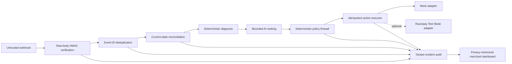
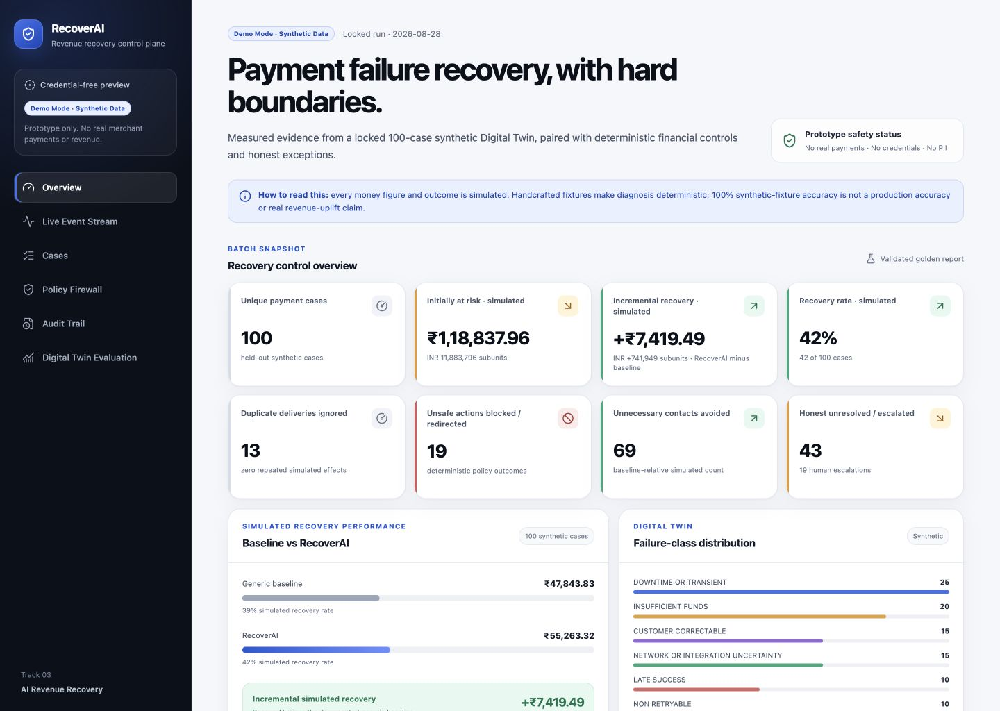
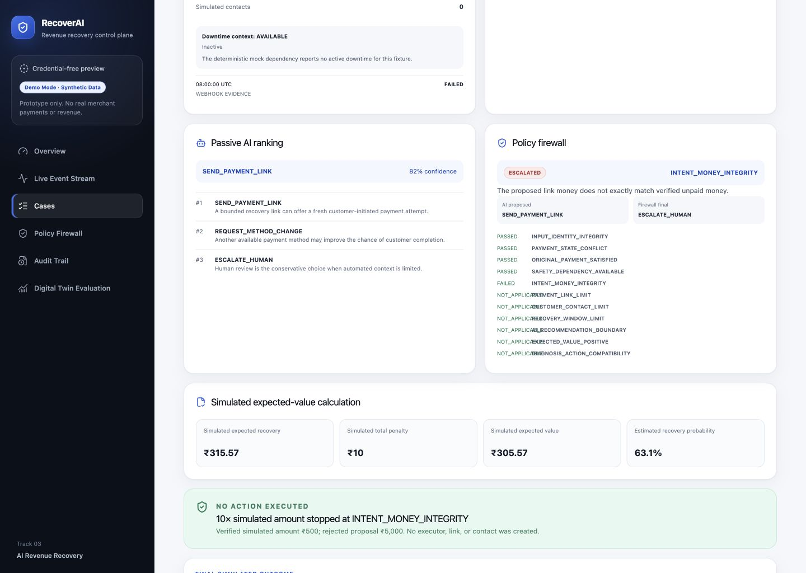
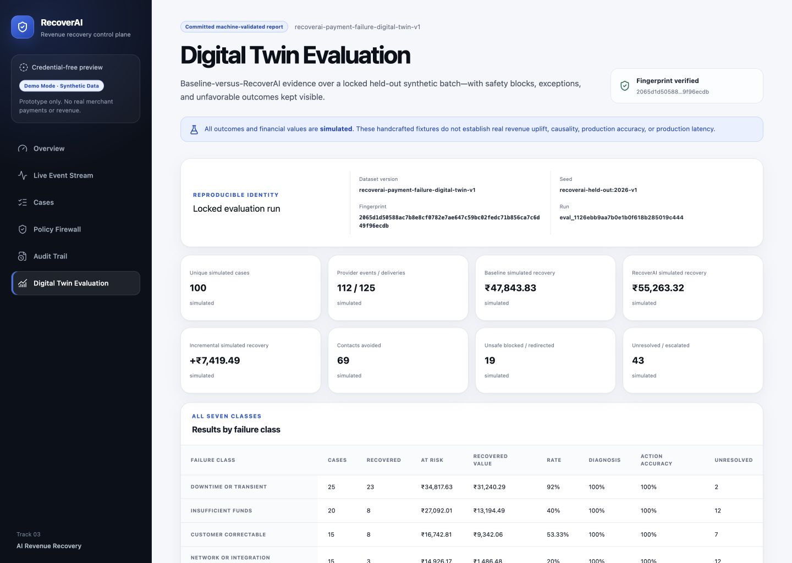

# RecoverAI — Payment Failure Digital Twin & Bounded Recovery Agent

RecoverAI is a Track 03 payment-recovery control plane that diagnoses failed or uncertain payments, ranks only safe candidate actions, and lets deterministic financial policy decide what may execute.

**[Live Demo](https://recoverai-production-6446.up.railway.app/)** · **[Public GitHub Repository](https://github.com/amarkumar00/recoverai)** · **[Passing GitHub Actions CI](https://github.com/amarkumar00/recoverai/actions/workflows/ci.yml)**

- **Team:** RecoverAI
- **Builder:** Amar Kumar
- **Role:** Solo Builder — Full-stack Engineer & Product Designer
- **Track:** Track 03 — AI Revenue Recovery

> [!IMPORTANT]
> **Prototype and simulated-results disclaimer:** the default application is a credential-free deterministic Demo Mode. Every dashboard rupee amount, recovery result, and held-out outcome is **simulated** synthetic data—not real merchant revenue, production uplift, or causal evidence. The project is not production-ready. Razorpay Live Mode is rejected. Optional Razorpay Test Mode support exists, but live verification was `NOT_RUN_CREDENTIALS_UNAVAILABLE` and zero live Payment Links were created during verification.

## Verified public deployment

The public Railway deployment runs credential-free **Demo Mode** on Node.js 22 with one application instance and SQLite at `/data/recoverai.db` on the persistent `/data` volume. No Razorpay credentials are configured. Phase B4 verification made zero external financial calls and created zero real or Test Mode Payment Links; the primary judge flow uses only a deterministic mock Payment Link with no public URL or customer message.

Public-demo availability currently depends on the Railway Free Trial. No billing details, paid upgrade, or paid Railway feature was used during release verification.

## The problem

Payment failures have different causes: temporary provider downtime, insufficient funds, customer-correctable input, integration uncertainty, late success, and hard failure. Applying one generic intervention to every case can waste customer contacts, create duplicate-collection risk, or recover less value.

## The solution

RecoverAI turns a failed-payment event into an explainable, bounded workflow:

1. Verify and deduplicate the event.
2. Reconcile the current payment state instead of trusting event arrival order.
3. Diagnose known structured errors deterministically.
4. Rank only the diagnosis's fixed candidate actions.
5. Apply hard money, state, contact, timing, and confidence rules.
6. Execute an idempotent mock or optional Test Mode Payment Link operation.
7. Stop after late payment success and record tamper-evident evidence.

The result is a working credential-free demo, six adversarial scenarios, and a locked 100-case held-out Digital Twin evaluation.

## Why AI is used

Known structured errors are handled deterministically. The AI boundary is reserved for comparing plausible interventions when more than one bounded choice remains.

- It receives a deterministic candidate set and returns passive rankings only.
- Provider output is untrusted and schema-validated.
- The default `DeterministicMockAiProvider` is a seeded handcrafted test double, not a trained production model or external LLM.
- It cannot provide amount, currency, recipient, API route, credentials, idempotency keys, or policy authority.
- Trusted application code calculates expected value with checked integer-subunit arithmetic.
- Malformed output, timeouts, provider errors, or insufficient context fail closed to human escalation.

## Safety principle

> **AI proposes; deterministic financial policy disposes.**

Only six actions exist: `WAIT_FOR_RECOVERY`, `SEND_PAYMENT_LINK`, `REQUEST_METHOD_CHANGE`, `CANCEL_RECOVERY_ALREADY_PAID`, `STOP_NON_RETRYABLE`, and `ESCALATE_HUMAN`. The policy firewall—not AI—checks current payment authority, exact amount and currency, one-active-link limit, two-contact limit, 24-hour recovery window, 0.70 minimum confidence, and positive expected value before execution.

## Architecture



Webhook snapshots are historical evidence; fresh provider reconciliation is the current financial authority. AI output is an untrusted proposal; the deterministic firewall is the execution authority. Provider operations, SQLite persistence, and audit writes are explicitly non-atomic and uncertain outcomes are never automatically retried.

See [Architecture](docs/ARCHITECTURE.md) for trust boundaries, the separate evaluator-only flow, persistence design, and failure semantics.

## Working product surfaces

- **Overview** (`/`) — locked simulated headline metrics and baseline comparison.
- **Live Event Stream** (`/events`) — duplicate, out-of-order, webhook-evidence, and reconciled-state views.
- **Cases** (`/cases`) — one persisted bounded recovery loop plus six fixed safety scenarios.
- **Policy Firewall** (`/policy`) — read-only limits, six-action allowlist, and ordered decisions.
- **Audit Trail** (`/audit`) — verified local SHA-256 hash chain and anchor status.
- **Digital Twin Evaluation** (`/evaluation`) — exact results, all seven classes, 7×7 confusion matrix, and honest exceptions.







## Exact held-out simulated results

The locked batch contains **100 held-out synthetic payments**, **112 unique provider events**, **125 deliveries**, and **13 duplicate deliveries**. Money is stored and aggregated in INR subunits; rupee conversions below divide by 100.

| Metric                                         |                                       Locked result |
| ---------------------------------------------- | --------------------------------------------------: |
| Simulated revenue initially at risk            | INR 11,883,796 subunits / **₹118,837.96 simulated** |
| Baseline simulated recovery                    |   INR 4,784,383 subunits / **₹47,843.83 simulated** |
| RecoverAI simulated recovery                   |   INR 5,526,332 subunits / **₹55,263.32 simulated** |
| Incremental simulated recovery                 |     INR +741,949 subunits / **₹7,419.49 simulated** |
| RecoverAI simulated recovery rate              |                                                 42% |
| Root-cause accuracy                            |              100% on handcrafted synthetic fixtures |
| Action-selection accuracy                      |                                                 95% |
| Customer contacts avoided                      |                                                  69 |
| Unsafe actions blocked or redirected           |                                                  19 |
| Human escalation rate                          |                                                 19% |
| Honest unresolved/escalated simulated outcomes |                                                  43 |
| Simulated false-positive intervention cost     |           INR 3,436 subunits / **₹34.36 simulated** |

The primary comparison is `₹55,263.32 − ₹47,843.83 = ₹7,419.49 simulated`. The baseline is not a zero-value straw man: at exactly 15 deterministic minutes it sends one generic Payment Link to every eligible verified-unpaid case, reusing an active link and stopping or escalating unsafe cases.

- Dataset fingerprint: `2065d1d50588ac7b8e8cf0782e7ae647c59bc02fedc71b856ca7c6d49f96ecdb`
- Golden JSON SHA-256: `0405a6621ba88f362877907ba7dea1624643696b92907ef5f4b13cf9bf22f30c`
- [Human-readable report](docs/evaluation/GOLDEN_REPORT.md) · [machine-valid JSON](docs/evaluation/golden-report.json)

## Five-minute quick demo

1. Open **Digital Twin Evaluation** and establish the locked 100-case simulated result.
2. In **Cases**, run **Duplicate webhook delivery** and **Out-of-order payment events**.
3. Run **Invalid AI-proposed 10× amount**, then open **Policy Firewall** or the unsafe case detail to show `INTENT_MONEY_INTEGRITY` blocking execution.
4. Start the primary bounded recovery, inspect diagnosis → ranking → policy → mock link, then select **Simulate mock link paid**.
5. Close on the Overview: ₹7,419.49 incremental simulated recovery, 69 contacts avoided, 19 unsafe actions blocked/redirected, and 43 honest unresolved/escalated simulated outcomes.

Use the exact timestamps, narration, expected states, and fallbacks in the [five-minute demo script](docs/submission/DEMO_SCRIPT.md).

## Credential-free setup

Prerequisites: Node.js 22+ and npm 10+.

```bash
npm ci
cp .env.example .env.local
npm run db:migrate
npm run dev
```

Open <http://localhost:3000>. No Razorpay or LLM credential is required. A fresh isolated database can be migrated without touching the default database:

```bash
DATABASE_PATH=./data/recoverai-fresh.db npm run db:migrate
```

For a production-mode local check:

```bash
npm run build
npm run start
```

See [Setup and operations](docs/SETUP_AND_OPERATIONS.md) for reset, environment, webhook, clean-checkout, and optional Test Mode instructions.

## Evaluation reproduction

```bash
npm run evaluation:check
```

This regenerates the locked evaluation in memory and requires exact equality with the committed report. It uses no network, credentials, live Razorpay call, customer message, or real financial action.

## Automated verification

```bash
npm run check
```

The complete command checks documentation links/locks, formatting, lint, strict types, fresh/upgraded migrations, dataset and golden-report integrity, the deterministic test suite, production build, high-severity production dependency audit, repository hygiene, and a credential-free production HTTP smoke.

At the Milestone 16 evidence lock, **652 tests across 51 files passed**. See the [verification matrix](docs/VERIFICATION_MATRIX.md). Normal CI uses Demo Mode, no secrets, and zero external financial calls.

## Optional Razorpay Test Mode

The server-only adapter is disabled by default and implements only documented Test Mode operations: payment fetch, downtime fetch, Standard Payment Link create/fetch/cancel, and relevant signed webhook events. Live Mode keys are rejected. Test Mode does not move real money.

Live Test Mode verification status for this repository is **`NOT_RUN_CREDENTIALS_UNAVAILABLE`**; zero live Payment Links were created during verification. The optional read-only smoke is separate from CI:

```bash
npm run smoke:test-mode:optional
```

Without private credentials it exits safely with `MISSING_OPTIONAL_TEST_MODE_CREDENTIALS`. Do not enable Test Mode writes unless you have deliberately configured a sandbox check and accepted the local three-attempt link budget. Full private configuration is in [Setup and operations](docs/SETUP_AND_OPERATIONS.md#optional-razorpay-test-mode).

## Security and reliability

- Exact raw request bytes are verified with HMAC-SHA256 before parsing.
- `x-razorpay-event-id` is claimed durably so concurrent duplicate deliveries converge.
- Fresh payment state, exact money identity, link state, and case version are rechecked before action.
- AI can rank only allowlisted actions; deterministic policy owns approval.
- Stable action identities and database constraints prevent repeated local execution.
- Late authorization/capture stops recovery and cancels only an eligible unpaid link.
- Provider timeout or uncertain write outcome fails closed with no automatic retry.
- Audit is tamper-evident, not immutable; the local anchor can be rewritten by an administrator with full database control.
- Raw bodies, credentials, customer contact fields, prompts, stack traces, hidden outcomes, and Test Mode short URLs are excluded from dashboard read models.

Read the concise [security model and limitations](docs/SECURITY_AND_LIMITATIONS.md).

## Known limitations

- Handcrafted synthetic outcomes do not prove production uplift, causality, accuracy, or latency.
- The default AI scorer is deterministic mock logic, not a trained production model.
- The live Razorpay Test Mode flow was not run because credentials were unavailable.
- No deployment rate limiting, secret rotation, multi-node coordination, distributed transaction, or automatic repair of uncertain external operations exists.
- SQLite is suitable for this local prototype, not multi-node production operation.
- No production authentication/authorization, real customer messaging, or real-money behavior exists.
- No arbitrary failed-payment retry, payment capture, refund, subscription, Route, Vulcan, or checkout-abandonment integration exists.

## Repository and document map

- [Architecture](docs/ARCHITECTURE.md)
- [Setup and operations](docs/SETUP_AND_OPERATIONS.md)
- [Security and limitations](docs/SECURITY_AND_LIMITATIONS.md)
- [Buildathon application copy](docs/submission/APPLICATION.md)
- [Five-minute demo script](docs/submission/DEMO_SCRIPT.md)
- [Judge Q&A](docs/submission/JUDGE_QA.md)
- [Submission checklist](docs/submission/SUBMISSION_CHECKLIST.md)
- [Golden evaluation](docs/evaluation/GOLDEN_REPORT.md)
- [Verification matrix](docs/VERIFICATION_MATRIX.md)
- [Product source of truth](docs/RECOVERAI_SPEC.md)
- [Architecture decisions](docs/DECISIONS.md)
- [Implementation roadmap](docs/ROADMAP.md)

## Official Razorpay references

- [Validate and test webhooks](https://razorpay.com/docs/webhooks/validate-test/) — raw-body HMAC, signature header, event-ID deduplication, and out-of-order delivery guidance.
- [Payments webhook events](https://razorpay.com/docs/webhooks/payments/) and [Payment Links webhook events](https://razorpay.com/docs/webhooks/payment-links/) — supported event payloads.
- [Fetch payment by ID](https://razorpay.com/docs/api/payments/fetch-with-id/) and [fetch payment downtimes](https://razorpay.com/docs/api/payments/downtime/fetch-all/).
- [Create](https://razorpay.com/docs/api/payments/payment-links/create-standard/), [fetch](https://razorpay.com/docs/api/payments/payment-links/fetch-id-standard/), and [cancel](https://razorpay.com/docs/api/payments/payment-links/cancel-standard/) a Standard Payment Link.
- [Payments API scope](https://razorpay.com/docs/api/payments/) — the API is not represented here as an arbitrary failed-payment recollection mechanism.

## License

This repository is licensed under the [MIT License](LICENSE). Copyright © 2026 Amar Kumar.
