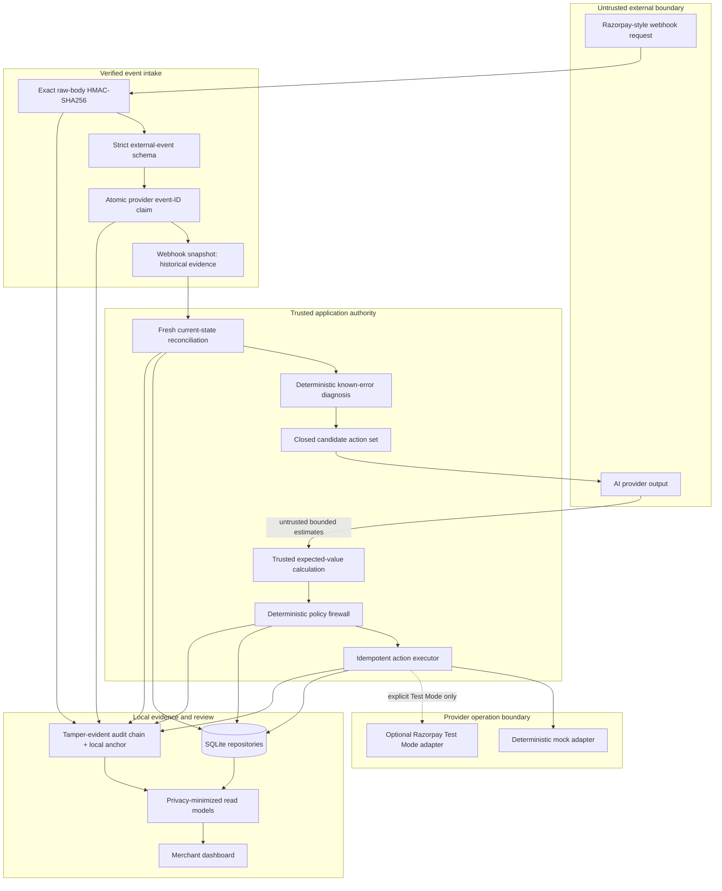
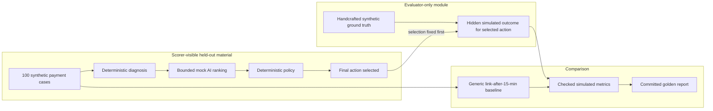

# RecoverAI Architecture

RecoverAI is a local-first Track 03 prototype. It separates untrusted evidence and probabilistic recommendations from trusted current-state and deterministic execution authority. Every financial result shown by the default application is **simulated**.

## Runtime flow



### Authority rules

- **Webhook payloads are evidence, not current financial authority.** Razorpay documents webhook payloads as entity snapshots and warns that delivery order can vary. RecoverAI therefore fetches the current payment through a narrow provider port before a material recovery action.
- **AI proposes; deterministic financial policy disposes.** AI output can rank only the diagnosis's allowlisted candidates. It cannot choose money, a recipient, a provider route, credentials, an idempotency key, or a policy limit.
- **Execution is capability-limited.** The port exposes payment fetch, downtime fetch, and Standard Payment Link create/fetch/cancel only. It exposes no original-payment retry, capture, refund, subscription, Route, customer-message, or arbitrary-request method.
- **The browser is read-only for policy.** Dashboard read models omit secrets, raw bodies, PII, hidden evaluator outcomes, provider short URLs, and executable financial instructions.

## Evaluation flow and leakage boundary



Scoring code cannot import evaluator-only hidden outcomes. The evaluator accepts a case ID and an already-fixed canonical action, then reveals only that action's **simulated** outcome. This boundary is enforced by module structure, lint restrictions, strict schemas, and tests; it is not cryptographic secrecy.

The locked evaluation contains 100 payments, 112 unique events, 125 deliveries, and 13 duplicate deliveries. Its dataset fingerprint is `2065d1d50588ac7b8e8cf0782e7ae647c59bc02fedc71b856ca7c6d49f96ecdb`; the committed golden JSON SHA-256 is `0405a6621ba88f362877907ba7dea1624643696b92907ef5f4b13cf9bf22f30c`.

## Trust boundaries

| Boundary                | Incoming trust                           | What becomes authoritative                                                                        |
| ----------------------- | ---------------------------------------- | ------------------------------------------------------------------------------------------------- |
| Public webhook          | Untrusted bytes and headers              | Nothing until exact raw-body HMAC, event-ID, JSON, and schema validation pass                     |
| Webhook snapshot        | Verified historical evidence             | Event history only; never current payment authority by itself                                     |
| Provider reconciliation | Narrow adapter response                  | Current state only after identity, order, amount, currency, status, and monotonic-success checks  |
| AI ranking              | Untrusted structured estimates           | Nothing executable; trusted code validates the complete candidate set and computes expected value |
| Policy firewall         | Trusted domain context and configuration | The only approval, block, stop, or escalation authority                                           |
| Provider operation      | External non-transactional effect        | Observed outcome; uncertainty is retained and not automatically retried                           |
| Evaluator-only outcome  | Hidden handcrafted synthetic fixture     | Offline simulated metrics only; never operational authority                                       |
| Dashboard               | Privacy-minimized read DTOs              | Explanation and review only; no editable policy or arbitrary action controls                      |
| Audit anchor            | Local SQLite chain head                  | Local tamper evidence while the database and anchor remain trustworthy                            |

## Webhook intake

`POST /api/webhooks/razorpay` verifies `X-Razorpay-Signature` as HMAC-SHA256 over the exact untouched body using a server-only webhook secret. Parsing, persistence, case processing, and audit do not begin before verification. The implementation uses timing-safe digest comparison after strict signature-shape validation.

The documented `x-razorpay-event-id` header is the durable deduplication key. A SQLite unique claim arbitrates concurrent deliveries. Identical replay returns a safe duplicate response without another downstream effect; reuse with conflicting raw content fails closed.

Supported normalized event names are:

- `payment.failed`, `payment.authorized`, `payment.captured`
- `order.paid`
- `payment.downtime.started`, `payment.downtime.resolved`, `payment.downtime.updated`
- `payment_link.paid`, `payment_link.partially_paid`, `payment_link.cancelled`, `payment_link.expired`

Official evidence: [webhook validation and idempotency](https://razorpay.com/docs/webhooks/validate-test/), [payment events](https://razorpay.com/docs/webhooks/payments/), and [Payment Link events](https://razorpay.com/docs/webhooks/payment-links/).

## Diagnosis, ranking, and policy

Known structured `error_reason` values and compatible downtime context are mapped deterministically. Free-form descriptions are not fuzzy-matched. Unknown, unavailable, or contradictory context remains ambiguous and escalates.

The default scorer is a deterministic handcrafted mock/test double. It returns bounded recovery-probability estimates for the deterministic candidate set. Trusted code calculates:

```text
floor(verified unpaid subunits × probability millionths / 1,000,000)
− contact cost
− friction penalty
− duplicate-payment-risk penalty
− operational cost
```

The policy firewall evaluates fixed rules in safety-first order. It verifies identity, state, provider availability, money integrity, Payment Link limits, contact limits, recovery window, AI schema/confidence, expected value, and diagnosis compatibility. A failed check yields no arbitrary fallback action; it blocks, stops, or escalates with an exact rule and reason.

## Idempotent execution and provider uncertainty

Stable SHA-256-derived identities bind recovery action, idempotency, link reference, and audit evidence. Database compare-and-set transitions allow only one owner to move an action through:

```text
REQUESTED → STARTED → SUCCEEDED | FAILED_SAFE | CANCELLED
```

Before creating a link, the executor re-fetches payment state and re-reads the persisted case/version. One blocking link per order is also enforced in SQLite. Late authorization or capture stops outreach and cancels only a fetched link still in `CREATED` state with zero paid amount.

The provider, SQLite, and audit system cannot share a distributed transaction. RecoverAI never holds a SQLite transaction across an awaited provider call. If a provider write times out, its outcome is unknown; if a provider succeeds but local persistence or the final audit append fails, evidence is incomplete. These states fail closed and are never automatically retried. Operator repair is required.

## Adapters and operating modes

| Mode                          | Credentials                               | Network                   | Financial behavior                                   |
| ----------------------------- | ----------------------------------------- | ------------------------- | ---------------------------------------------------- |
| Demo Mode (default)           | None                                      | None                      | Deterministic mock links and outcomes, all simulated |
| Razorpay Test Mode (optional) | Complete server-only `rzp_test_` key pair | Fixed official API origin | Sandbox-only narrow reads/writes; no real money      |
| Live Mode                     | Rejected                                  | Not available             | No path exists                                       |

The optional adapter uses fixed documented operations only:

- [`GET /v1/payments/:id`](https://razorpay.com/docs/api/payments/fetch-with-id/)
- [`GET /v1/payments/downtimes`](https://razorpay.com/docs/api/payments/downtime/fetch-all/)
- [`POST /v1/payment_links`](https://razorpay.com/docs/api/payments/payment-links/create-standard/)
- [`GET /v1/payment_links/:id`](https://razorpay.com/docs/api/payments/payment-links/fetch-id-standard/)
- [`POST /v1/payment_links/:id/cancel`](https://razorpay.com/docs/api/payments/payment-links/cancel-standard/)

The API origin is fixed to `https://api.razorpay.com`; Basic Authentication stays server-side. Requests have bounded timeouts and response sizes, strict response normalization, sanitized failures, and no automatic write retry. Live verification remains `NOT_RUN_CREDENTIALS_UNAVAILABLE`; zero live Payment Links were created during verification.

## Persistence and audit

Committed migrations create a SQLite schema for webhook events, payment snapshots, recovery cases, AI recommendations, policy decisions, recovery actions, Payment Links, audit entries, simulated evaluation runs, scenario results, and a single audit-chain anchor. Integer subunits, foreign keys, unique event/action identities, and one-blocking-link-per-order constraints are enforced at both repository and database boundaries.

The audit service hashes versioned canonical JSON with SHA-256, binds each entry to its predecessor, and atomically advances the local chain head. It detects editing, insertion, deletion, and reordering while the local database and anchor remain trustworthy.

The audit is **tamper-evident, not immutable**. An administrator able to rewrite every entry and the local anchor can construct a different locally valid chain. An independently retained checkpoint would strengthen detection, but external anchoring is outside this MVP.

## Why SQLite is bounded to the prototype

SQLite keeps the demo credential-free, durable, reproducible, and easy to migrate from a clean checkout. WAL mode, foreign keys, a bounded busy timeout, uniqueness constraints, and compare-and-set updates cover the local concurrency model.

It is not a multi-node coordination system. This repository includes no distributed lock, queue, leader election, replicated audit anchor, horizontal webhook arbitration, or automatic recovery worker. A production design would require durable multi-node storage and work ownership, authentication/authorization, rate limiting, secret rotation, privacy review, observability, and an operator repair process.

## Module map

- `src/domain/` — strict runtime vocabulary and schemas
- `src/webhooks/` — verification, normalization, deduplication, and processor handoff
- `src/reconciliation/` — provider-reconciled payment authority
- `src/diagnosis/` — exact known-error mapper
- `src/ai/` — passive provider boundary, expected value, and safe fallback
- `src/policy/` — deterministic firewall
- `src/recovery/` and `src/orchestration/` — state transitions, execution, and resumable workflow
- `src/adapters/razorpay/` — deterministic mock and optional Test Mode adapters
- `src/audit/` — canonical hash chain and local anchor
- `src/digital-twin/` and `src/evaluation/` — held-out generator, evaluator-only outcome boundary, baseline, and metrics
- `src/dashboard/` and `src/components/` — validated privacy-minimized read models and UI
- `drizzle/` and `src/repositories/` — committed migrations and storage boundaries

For exact threats and exclusions, see [Security and limitations](SECURITY_AND_LIMITATIONS.md). For implementation decisions, see [Architecture Decision Log](DECISIONS.md).
